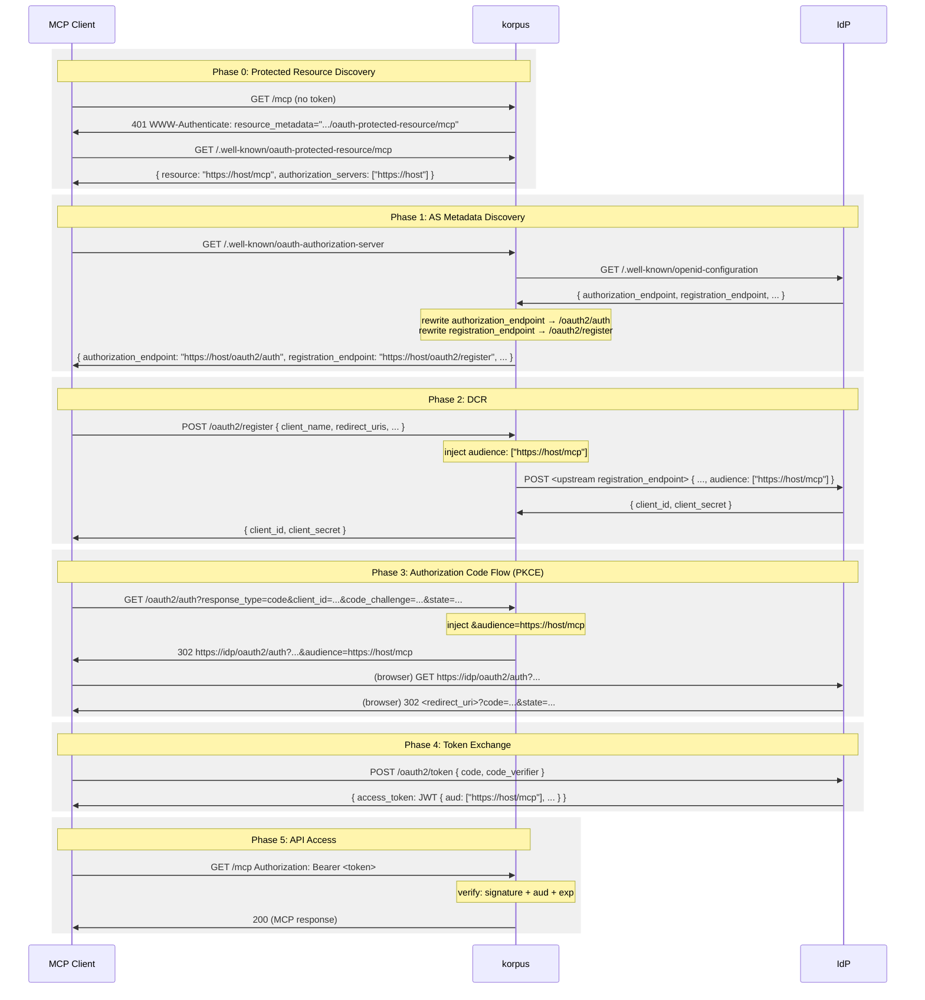

# OAuth 2.0 DCR Flow

When OIDC is enabled, korpus acts as a proxy between MCP clients and the upstream IdP to support [Dynamic Client Registration (RFC 7591)](https://datatracker.ietf.org/doc/html/rfc7591). This proxy layer exists because some IdPs do not automatically include an audience (`aud`) claim in issued access tokens — the client must explicitly request the audience in each authorization request. korpus injects this parameter transparently so MCP clients work without any extra configuration.

## Sequence

## What korpus proxies

| Endpoint | Role |
|---|---|
| `GET /.well-known/oauth-protected-resource/mcp` | RFC 9728 resource metadata; points clients at korpus as the AS |
| `GET /.well-known/oauth-authorization-server` | RFC 8414 AS metadata (proxied from IdP, endpoints rewritten) |
| `GET /.well-known/openid-configuration` | OIDC discovery (same document, same rewrites) |
| `POST /oauth2/register` | DCR proxy; injects `audience` into the registration body |
| `GET /oauth2/auth` | Authorization endpoint proxy; injects `audience` query parameter |

Token exchange (`POST /oauth2/token`) and JWKS (`GET /.well-known/jwks.json`) go directly to the IdP — korpus does not intercept them.
